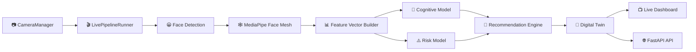
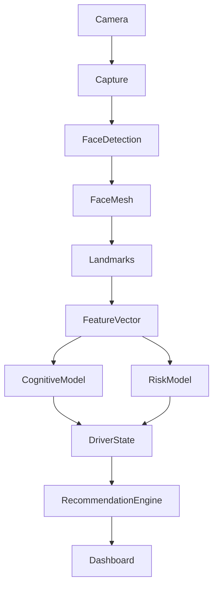
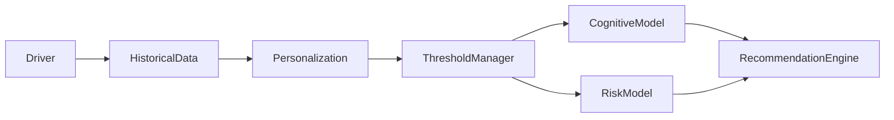
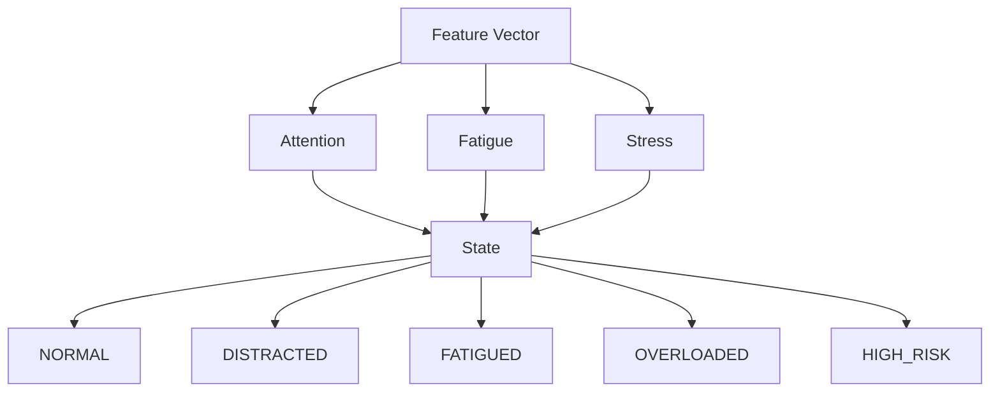
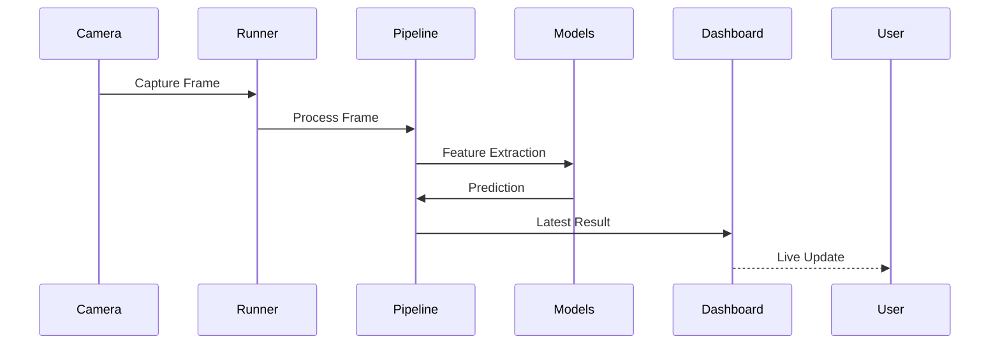
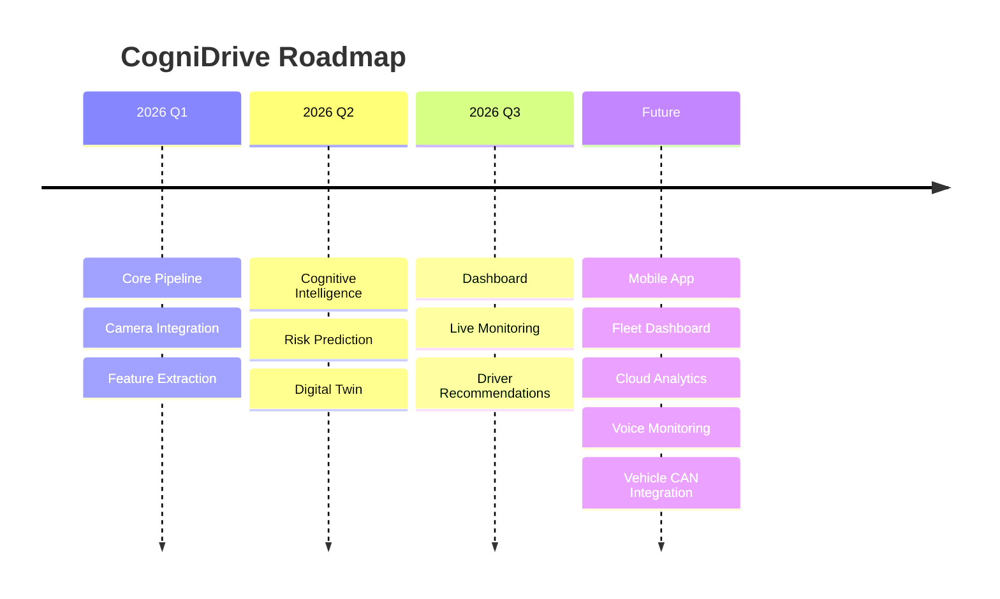

<div align="center">

# 🚗 CogniDrive

### AI-Powered Driver Cognitive Monitoring System

### Built for the Tata Technologies InnoVent Hackathon 2026


<br>


</div>

---

# 🌌 Overview

> **CogniDrive** is an AI-powered Driver Monitoring System developed for the **Tata Technologies InnoVent Hackathon**.

It combines **Computer Vision**, **Machine Learning**, **Digital Twin Technology**, and **Real-Time Edge AI** to monitor driver behavior and proactively identify fatigue, distraction, cognitive overload, and accident risk.

Unlike conventional monitoring systems, CogniDrive performs inference entirely on-device, enabling **low-latency**, **privacy-preserving**, and **offline-capable** driver assistance.

---

<div align="center">

## 😺 Before We Continue...


*"Compiling... Please do not pet the AI."*

</div>

---

# ✨ Features

- 🎥 Live Camera Monitoring
- 🧠 Cognitive Load Estimation
- 😴 Fatigue Detection
- 👀 Driver Distraction Analysis
- 📈 Accident Risk Prediction
- 🤖 Driver Digital Twin
- 📊 Real-Time Dashboard
- 🔄 Continuous Live Processing
- 🚗 Offline Edge AI
- 🧩 Modular ML Pipeline
- ⚡ Multithreaded Processing
- 📡 FastAPI Backend
- 🔐 Privacy-First (No Cloud Required)

---

# 🎯 Why CogniDrive?

Road accidents are often caused by:

- Driver fatigue
- Cognitive overload
- Phone distraction
- Long driving hours
- Reduced attention

CogniDrive continuously monitors these factors and provides **real-time intelligence** to improve road safety.

---

# 🎥 Project Preview

<div align="center">

## *(Replace these with your screenshots)*

| Dashboard | Live Detection |
|------------|----------------|
|  |  |

</div>

---

# ⚙️ Tech Stack

| Domain | Technologies |
|---------|--------------|
| Language | Python |
| Backend | FastAPI |
| Database | SQLite + SQLAlchemy |
| Computer Vision | OpenCV |
| Landmark Detection | MediaPipe Face Mesh |
| Deep Learning | TensorFlow Lite |
| ML Models | LightGBM, XGBoost, Scikit-learn |
| Numerical Computing | NumPy, Pandas |
| Deployment | Edge AI |

---

# 📑 Table of Contents

- Overview
- Features
- Architecture
- AI Pipeline
- Folder Structure
- Installation
- Running the Project
- Dashboard
- API
- Models
- Screenshots
- Roadmap
- Contributors
- License

---

<div align="center">

# 🚀 System at a Glance

```text
Camera
   │
   ▼
Face Detection
   │
   ▼
Face Mesh
   │
   ▼
Feature Vector
   │
   ▼
AI Models
   │
   ▼
Risk Analysis
   │
   ▼
Recommendations
   │
   ▼
Dashboard
```

</div>

---

<div align="center">

## ☕ Installing Dependencies Like...


*"Waiting for pip to finish..."*

</div>

---

# 🌟 Highlights

✅ Offline First

✅ Edge AI

✅ Digital Twin

✅ Real-Time Monitoring

✅ Cognitive Intelligence

✅ Driver Safety Analytics

✅ Live Dashboard

✅ FastAPI Backend

---

<div align="center">

### ⭐ If you like this project, consider giving it a star!

</div>
---

# 🏗️ System Architecture

CogniDrive follows a modular pipeline where every component is isolated, making it easy to maintain, scale, and replace individual AI models.



---

# 🧠 AI Inference Pipeline



---

<div align="center">

## 😺 The AI after finding a face...


*"Target acquired."*

</div>

---

# 📂 Repository Structure

```text
CogniDrive/

backend/

├── api/
│
├── app/
│
├── database/
│
├── demo/
│
├── engine/
│
├── features/
│
├── ml/
│   ├── inference/
│   ├── training/
│   ├── digital_twin/
│   └── recommendation/
│
├── services/
│
├── vision/
│
└── main.py

datasets/

logs/

requirements.txt

README.md
```

---

# 🧩 Core Components

| Module | Responsibility |
|----------|----------------|
| CameraManager | Camera lifecycle management |
| LivePipelineRunner | Continuous frame processing |
| PipelineManager | Orchestrates complete inference pipeline |
| LandmarkExtractor | Face landmark extraction |
| FeatureVectorBuilder | Generates 21-dimensional feature vector |
| CognitiveModel | Estimates cognitive load |
| RiskModel | Predicts accident probability |
| RecommendationEngine | Generates contextual recommendations |
| Digital Twin | Learns driver-specific behaviour |

---

# 🧬 Digital Twin Architecture

Instead of treating every driver equally, CogniDrive maintains a lightweight Digital Twin that adapts thresholds based on historical driving behaviour.



---

# 🎯 Driver State Classification



---

# 📊 AI Models

| Model | Purpose |
|---------|---------|
| MediaPipe Face Mesh | Facial Landmark Detection |
| MobileFaceNet | Face Embeddings |
| Cognitive Model | Cognitive Load Prediction |
| Risk Model | Accident Risk Prediction |
| Recommendation Engine | Driver Assistance |
| Digital Twin | Personalized Threshold Learning |

---

# 🔄 Live Processing Loop



---

# ⚡ Processing Flow

```text
Live Camera
      │
      ▼
Capture Frame
      │
      ▼
Face Detection
      │
      ▼
Face Mesh
      │
      ▼
Feature Extraction
      │
      ▼
AI Models
      │
      ▼
Driver State
      │
      ▼
Recommendations
      │
      ▼
Dashboard
```

---

<div align="center">

## 🐈 The pipeline after processing 300 frames...


*"Still going strong."*

</div>

---

# 📈 Project Statistics

| Metric | Value |
|---------|------:|
| Programming Language | Python |
| Backend Framework | FastAPI |
| Computer Vision | OpenCV |
| Landmark Model | MediaPipe Face Mesh |
| ML Models | 5 |
| Processing | Real-Time |
| Camera Pipeline | Continuous |
| Deployment | Offline Edge AI |
| Architecture | Modular |

---

# 🔐 Design Principles

- Modular Architecture
- Offline First
- Privacy Focused
- Low Latency
- Edge AI
- Scalable Components
- Thread Safe Processing
- Extensible ML Pipeline

---
---

# 🚀 Getting Started

<div align="center">

### Ready in under **5 minutes**


*"Let's build something awesome."*

</div>

---

# 📋 Prerequisites

| Requirement | Version |
|-------------|---------|
| Python | 3.11+ |
| Git | Latest |
| Webcam | Required |
| OS | Windows / Linux |
| RAM | 8GB+ Recommended |

---

# 📥 Clone Repository

```bash
git clone https://github.com/ShlokMajumdar007/CogniDrive.git

cd CogniDrive
```

---

# 🐍 Create Virtual Environment

Windows

```bash
python -m venv venv

venv\Scripts\activate
```

Linux

```bash
python3 -m venv venv

source venv/bin/activate
```

---

# 📦 Install Dependencies

```bash
pip install -r requirements.txt
```

---

<div align="center">

## 😺 Installing packages...


*"Almost there..."*

</div>

---

# 🤖 Download Models

Place the following models inside

```
backend/ml/models_saved/
```

| Model | Purpose |
|---------|---------|
| mobilefacenet.tflite | Face Embeddings |
| cognitive_load_xgb.joblib | Cognitive Model |
| accident_risk_lgb.joblib | Risk Prediction |
| anomaly_isolation_forest.joblib *(optional)* | Anomaly Detection |
| face_landmarker.task | MediaPipe Landmark Detection |

---

# ▶️ Run CogniDrive

```bash
python -m uvicorn backend.main:app --reload --port 8001
```

Server starts at

```
http://127.0.0.1:8001
```

Swagger

```
http://127.0.0.1:8001/api/v1/docs
```

---

# 🌐 REST API

## Root

```
GET /
```

Returns

```json
{
  "service":"CogniDrive",
  "version":"1.0.0",
  "docs":"/api/v1/docs"
}
```

---

## Prediction

```
POST /api/v1/prediction/realtime
```

Processes a live frame and returns

- Driver State
- Cognitive Load
- Risk Score
- Recommendation
- Processing Time

---

## Dashboard

```
GET /api/v1/dashboard
```

Provides

- Live Metrics
- Driver State
- Recommendations
- Camera Feed
- System Health

---

## Authentication

```
POST /api/v1/auth/*
```

Handles

- Face Enrollment
- Verification
- Driver Identification

---

# 🖥 Dashboard

<div align="center">

### Replace with your screenshots

| Dashboard |
|------------|
|  |

</div>

---

# 🎥 Live Monitoring

<div align="center">


</div>

---

# 📈 Performance

| Metric | Value |
|----------|-------|
| Camera FPS | ~30 FPS |
| Landmark Detection | Real Time |
| Inference | <50ms |
| API Response | <100ms |
| Processing | Continuous |
| Backend | Multithreaded |

---

# ⚡ Pipeline Status

| Module | Status |
|---------|--------|
| CameraManager | ✅ |
| LivePipelineRunner | ✅ |
| Face Detection | ✅ |
| Landmark Detection | ✅ |
| Feature Extraction | ✅ |
| Cognitive Model | ✅ |
| Risk Model | ✅ |
| Recommendation Engine | ✅ |
| Dashboard | ✅ |

---

<div align="center">

## 😼 AI be like...


*"I detected fatigue before you detected this cat."*

</div>

---

# 📊 Example Driver Report

```
Driver ID        : 001

Attention Score : 92%

Fatigue         : LOW

Stress          : NORMAL

Risk            : LOW

Driver State    : NORMAL

Recommendation  : Continue Driving
```

---

# 🛠 Troubleshooting

## Camera not opening

✔ Close Teams/Zoom

✔ Check camera permissions

✔ Verify CameraManager starts

---

## Models not loading

Verify

```
backend/ml/models_saved/
```

contains all required files.

---

## Backend not starting

Run

```bash
pip install -r requirements.txt
```

---

<div align="center">

## 😿 Something broke?


*"Don't worry... we've all been there."*

</div>

---

# ❓ Frequently Asked Questions

### Does CogniDrive require Internet?

No.

Everything runs locally.

---

### Is any data uploaded?

No.

CogniDrive is completely offline.

---

### Does it support GPUs?

Yes.

TensorFlow Lite can utilize hardware acceleration where supported.

---

### Can it run on laptops?

Yes.

Designed for edge deployment.

---
---

# 🏆 Tata Technologies InnoVent Hackathon

<div align="center">


</div>

CogniDrive was developed as part of the **Tata Technologies InnoVent Hackathon**, where the objective was to build innovative AI-powered solutions addressing real-world mobility and transportation challenges.

The project focuses on improving **driver awareness and road safety** by combining computer vision, machine learning, and real-time inference into a practical Driver Monitoring System (DMS).

---

# 🌍 Real-World Applications

| Industry | Use Case |
|-----------|----------|
| 🚗 Automotive | Driver Monitoring Systems |
| 🚚 Logistics | Fleet Driver Safety |
| 🚕 Ride Sharing | Fatigue Detection |
| 🚌 Public Transport | Driver Alertness Monitoring |
| 🚓 Emergency Services | Long Shift Monitoring |
| 🏭 Industrial Vehicles | Operator Safety |
| 🚜 Agriculture | Heavy Equipment Monitoring |

---

# 🗺️ Project Roadmap



---

# 📊 Project Highlights

<div align="center">

| 🚀 | Value |
|---|------|
| AI Models | 5 |
| Landmark Points | 468 |
| Backend | FastAPI |
| Deployment | Edge AI |
| Processing | Real Time |
| Architecture | Modular |

</div>

---

# 🤝 Contributing

Contributions are welcome.

If you'd like to improve CogniDrive:

1. Fork the repository.
2. Create a feature branch.
3. Commit your changes.
4. Push the branch.
5. Open a Pull Request.

Please ensure new code follows the existing project structure and includes appropriate documentation where necessary.

---

# 💡 Future Improvements

- Driver Emotion Recognition
- Voice-Based Fatigue Analysis
- Multi-Camera Support
- Fleet Analytics Dashboard
- Mobile Companion Application
- Vehicle CAN Bus Integration
- Personalized Driving Insights
- Cloud Synchronization (Optional)
- Driver Authentication Enhancements

---

# 📚 References

- MediaPipe Face Mesh
- TensorFlow Lite
- FastAPI
- OpenCV
- LightGBM
- XGBoost
- Scikit-learn

---

# 👨‍💻 Author

<div align="center">

## Shlok Majumdar

Integrated M.Tech (Artificial Intelligence)

VIT Bhopal University

</div>

---

### Connect with Me

<p align="center">

<a href="https://github.com/ShlokMajumdar007">

</a>

<a href="https://www.linkedin.com/in/YOUR-LINKEDIN/">

</a>

</p>

> Replace `YOUR-LINKEDIN` with your actual LinkedIn profile URL.

---

# 📜 License

This project is licensed under the **MIT License**.

See the `LICENSE` file for details.

---

<div align="center">

## 😺 Thanks for visiting!


**If you found this project interesting, consider giving it a ⭐ on GitHub.**

Building safer roads with Computer Vision, Machine Learning, and Edge AI.

---

Made with ❤️ by **Shlok Majumdar**

</div>
